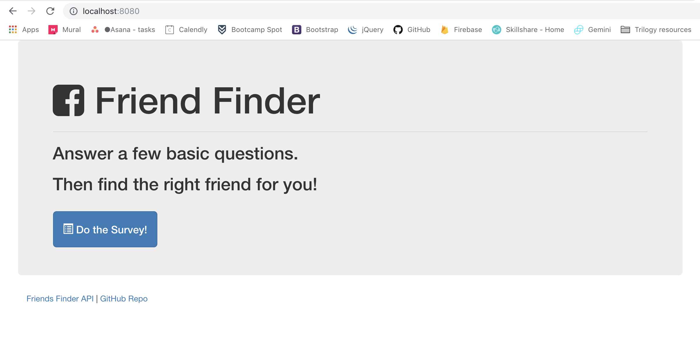
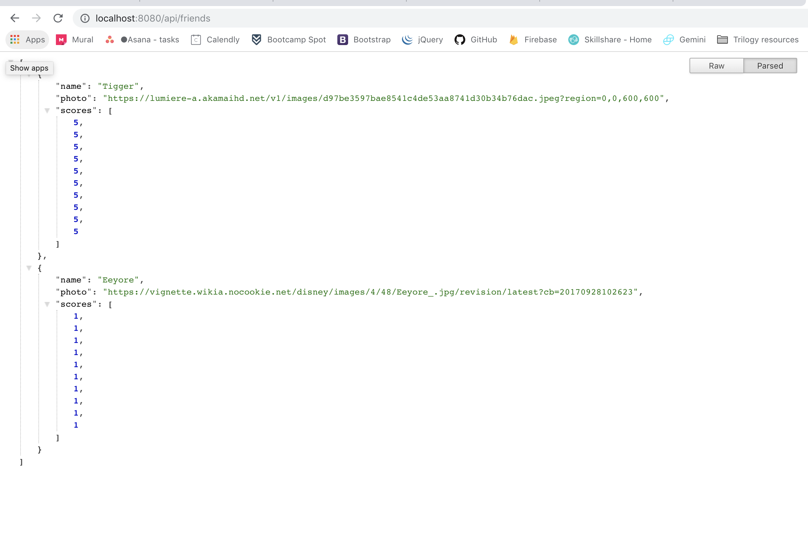
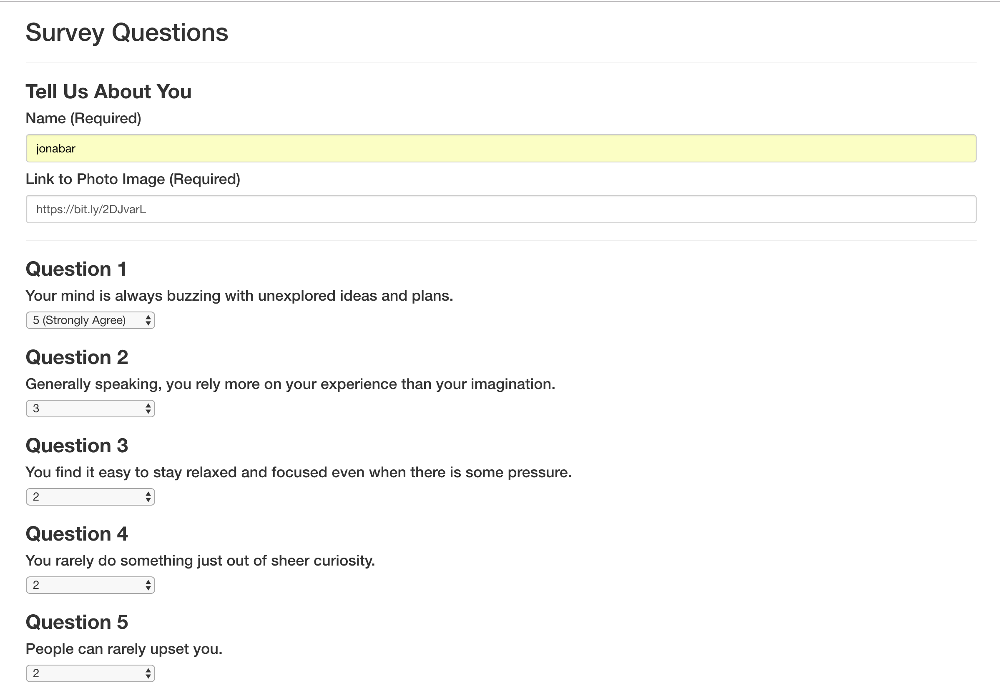
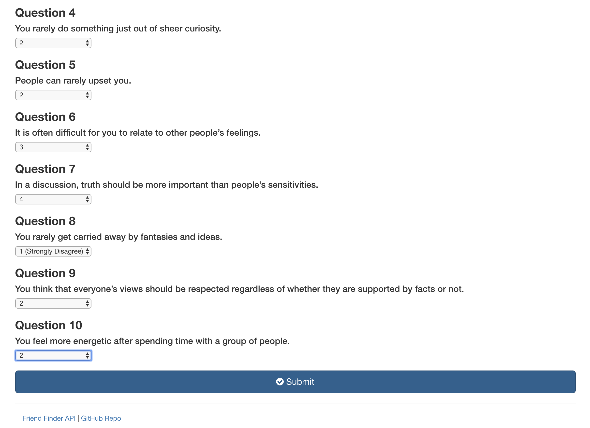
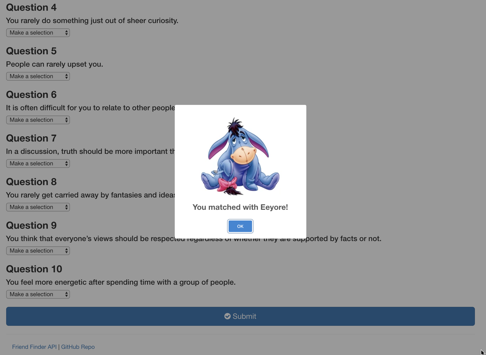
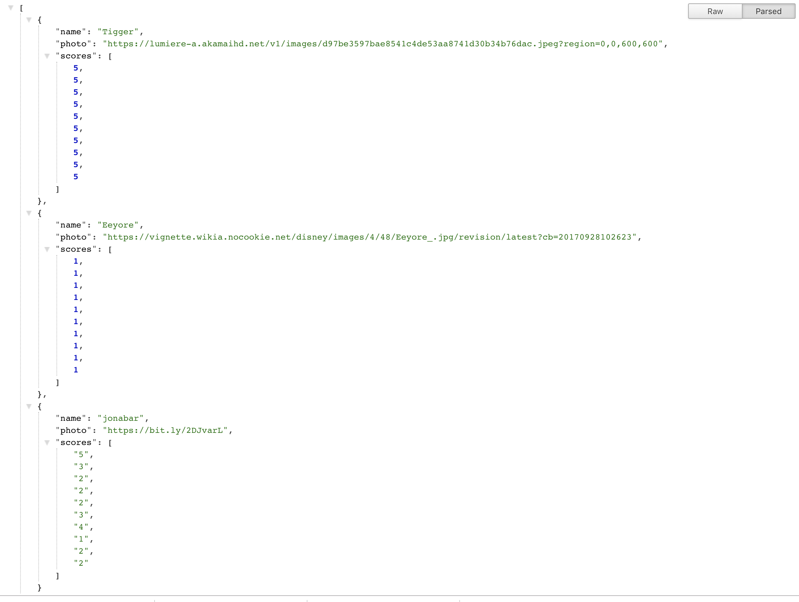

# 14-Friend-Finder

## What this is
This is a node.js application deployed in heroku that uses an express server to handle .get and .post requests to a simple API. The purpose of the application is to take inputs from the user and compare them to each of the potential "friends" already registered in the API. After finding the best possible friend match, the user's inputs are pushed to the API and they are now available as a potential match for any future users.

## Dependencies
This application uses the following npm modules and javascript/css libraries

 * sweetalert2.all.js
 * sweetalert2.css

 * express (creates server)
 * path (handles routing)
 * serverStatic (middleware for static pages in express)

 ## How to use
 Upon loading the application, the user will be able to take the survey, or click on the Friend Finder API link on the bottom left of the screen to see the contents of the API.

 

 The application already comes loaded with two frineds: Tigger and Eeyore. The are recorded as objects in an array called "friends".

  

Going back and clicking on "Take the survey" will bring users to a form, where they will be able to fill in their name, add an image URL, and answer a short personality quiz.

 

After completing the quiz, the user can click on "Submit". This prompts the app to get the information in the API and compare the user's answers to teh quiz to each of the potential friends in the API.

 

After finding a match, the application displays the results in a modal and resets the values of the form.

 

 Afterwards, the application posts the user's information to the API so that the user can be a potential "friend" for future users to be matched with.

 
